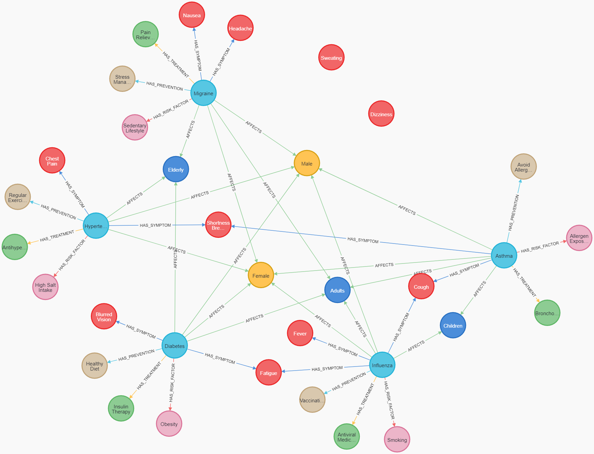

# Medical Knowledge Graph System

A modular Python application for querying a medical knowledge graph using natural language and evaluating responses with and without graph-based context.

## Project Overview

This system combines:
- A Neo4j graph database containing medical relationships (diseases, symptoms, treatments, etc.)
- Natural language processing for entity extraction and query classification
- Large Language Models (LLMs) for generating natural language responses
- Evaluation tools to compare accuracy with and without graph-based context
- Comprehensive logging system for tracking application behavior and debugging

## Project Structure

The project follows a modular architecture:

```
src/
├── config.py                # Configuration settings and logging setup
├── main.py                  # Main entry point
├── example.py               # Example usage
├── db/                      # Database interaction
│   ├── __init__.py
│   └── connection.py        # Neo4j connection handling
├── nlp/                     # Natural language processing
│   ├── __init__.py
│   ├── entity_extraction.py # Entity extraction from text
│   └── llm.py               # LLM response generation
├── query/                   # Query generation and execution
│   ├── __init__.py
│   └── cypher.py            # Cypher query generation
├── evaluation/              # Evaluation functions
│   ├── __init__.py
│   └── accuracy.py          # Factual accuracy evaluation
├── reporting/               # Report generation
│   ├── __init__.py
│   └── report.py            # Evaluation report generation
└── utils/                   # Utility functions
    └── __init__.py
logs/                        # Directory for application log files
db_scripts/                  # Database initialization scripts
├── init_neo4j.cypher        # Neo4j database initialization script
docs/                        # Documentation
├── images/                  # Documentation images
    └── neo4j_schema.png     # Neo4j database schema visualization
```

## Setup

1. Install dependencies:
```
pip install -r requirements.txt
```

2. Set up a Neo4j database (make sure Neo4j is running)

3. Initialize the database with the Cypher script:
```
cat db_scripts/init_neo4j.cypher | cypher-shell -u neo4j -p your_password
```
   Alternatively, you can copy and paste the commands from `db_scripts/init_neo4j.cypher` into the Neo4j Browser.

4. Configure environment variables in a `.env` file:
```
NEO4J_URI=bolt://localhost:7687
NEO4J_USERNAME=neo4j
NEO4J_PASSWORD=your_password
LLM_MODEL=gemma3:4b
LOG_LEVEL=INFO
LOG_DIR=logs
```

## Database Schema

The Medical Knowledge Graph uses the following schema:



The schema includes:
- Disease nodes
- Symptom nodes 
- Treatment nodes
- Prevention nodes
- Risk factor nodes
- Age group nodes
- Gender nodes
- Relationships between these entities

## Usage

### Interactive Mode

Run the application in interactive mode to ask questions:

```bash
python -m src.main --mode interactive --use_graph
```

### Single Question Mode

Ask a single question:

```bash
python -m src.main --mode single --question "What are the symptoms of Influenza?" --use_graph
```

### Evaluation Mode

Evaluate the system on sample questions and generate a report:

```bash
python -m src.main --mode evaluate --report my_evaluation.md
```

### Example Usage

See `src/example.py` for examples of using individual components:

```bash
python -m src.example
```

## Functional Components

### Entity Extraction

```python
from src.nlp.entity_extraction import extract_entities

entities = extract_entities("What are the symptoms of Influenza?")
```

### Query Generation

```python
from src.query.cypher import execute_cypher_query

results = execute_cypher_query("What treatments are available for Diabetes?")
```

### Response Generation

```python
from src.nlp.llm import generate_response

response = generate_response("What are the symptoms of Asthma?", use_graph=True, context=context)
```

### Evaluation

```python
from src.evaluation.accuracy import evaluate_factual_accuracy

accuracy = evaluate_factual_accuracy(response)
```

## Logging System

The application implements a comprehensive logging system with the following features:

- Console logging for real-time monitoring
- File-based logging with automatic rotation (10MB file size limit, 10 backup files)
- Different log levels (DEBUG, INFO, WARNING, ERROR) configurable via environment variables
- Module-specific loggers for better traceability
- Detailed log format including timestamps, module names, and line numbers

### Log Configuration

Logging can be configured using environment variables:

```
LOG_LEVEL=INFO  # Set to DEBUG, INFO, WARNING, or ERROR
LOG_DIR=logs    # Directory where log files will be stored
```

### Accessing Logs

Log files are stored in the `logs` directory with timestamps in their filenames:
```
logs/medical_kg_20250321_234719.log
```

### Custom Module Loggers

Modules can obtain their own logger using:

```python
from src.config import get_logger

logger = get_logger("module_name")
```

## License

This project is licensed under the MIT License - see the [LICENSE](LICENSE) file for details. 